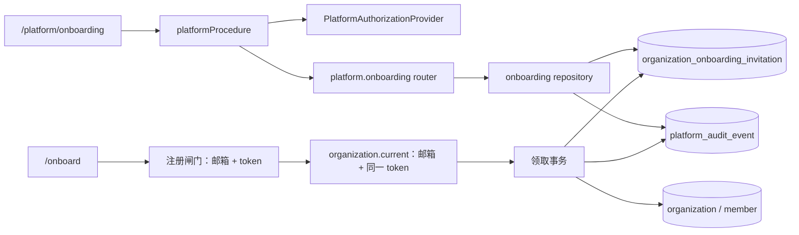

# 平台机构负责人初始化 Web 管理：技术设计

## 1. 设计目标

在不改变现有受邀人 `/onboard` 注册体验的前提下，为受控的平台操作员提供独立 Web 管理入口，并同时解决现有 onboarding 最终领取只按邮箱锁定、未重新校验 token 的竞态风险。

设计遵循以下边界：

- 平台权限与机构成员角色完全分离。
- 平台 API 不依赖当前机构，也不会为平台操作员隐式创建机构。
- 明文 token 只在创建或重新生成的首次成功响应中出现。
- 机构、owner、邀请领取和两类审计保持事务一致。
- 数据库迁移向前兼容，旧邀请与现有 `/onboard` 链路继续可用。

## 2. 总体结构



新增平台能力沿用现有 contracts → router → API repository wrapper → DB repository 分层，但授权中间件独立于机构中间件。

## 3. 平台授权设计

### 3.1 MVP 身份来源

- 新增仅服务端环境变量 `PLATFORM_OPERATOR_EMAILS`，值为逗号分隔邮箱列表。
- 启动时统一执行 trim、转小写、去重和邮箱格式校验。
- 空值或未配置表示没有任何平台操作员，系统 fail closed。
- 授权条件同时满足：
  1. 存在有效 session；
  2. `session.user.emailVerified === true`；
  3. session 中的规范化邮箱存在于服务端白名单。
- 不接受请求 body、query 或自定义 header 中声明的操作员邮箱。

### 3.2 可迁移边界

新增稳定能力接口，例如：

```ts
type PlatformCapability = "organization:onboard";

interface PlatformAuthorizationProvider {
	can(input: {
		userId: string;
		email: string;
		emailVerified: boolean;
		capability: PlatformCapability;
	}): Promise<boolean>;
}
```

MVP 使用 `EnvPlatformAuthorizationProvider`。未来切换数据库平台操作员模型时，以显式配置的授权模式替换 provider，不长期使用“环境白名单 OR 数据库权限”的隐式并集。

### 3.3 API 中间件

- 在 `packages/api/src/index.ts` 增加 `platformProcedure`。
- 它复用 session 校验，但不调用 `getOrCreateCurrentOrganization`，也不校验 `X-Expected-Organization-Id`。
- 未登录返回 `UNAUTHORIZED`；邮箱未验证或无平台能力返回 `FORBIDDEN`。
- 页面隐藏入口仅作体验优化，不能替代 router 的授权。

## 4. API 契约

新增顶层 `platform` router，避免并入 `training.organization` 的机构权限语义。

### 4.1 `platform.access.get`

用于登录后决定是否展示平台入口。返回当前用户拥有的平台 capability 列表或布尔值，不返回白名单内容。

### 4.2 `platform.onboarding.list`

输入：

- `cursor?: string`
- `limit?: number`，服务端限制最大值
- `status?: "pending" | "claimed" | "expired" | "revoked"`
- `email?: string`，可选精确或受控模糊搜索，沿用现有列表规范

输出按创建时间倒序，至少包含：

- invitation id
- 目标邮箱、机构名称
- 派生状态
- 创建时间、到期时间、撤销时间、领取时间
- 创建操作员的显示名/邮箱摘要
- 已创建机构 id（仅在已领取后存在）

输出绝不包含 token、token hash、完整邀请 URL 或内部备注之外的敏感认证数据。备注仅在平台操作员列表可见，不写入日志和审计 metadata。

### 4.3 `platform.onboarding.create`

输入：

- `email`
- `organizationName`
- `note?`
- `requestId`（UUID，客户端每次明确提交生成）

行为：

- 有效期固定为 7 天。
- 若同邮箱存在待领取且未关闭的邀请，返回 `CONFLICT`，不修改旧邀请。
- 若只有已领取、已撤销或已过期邀请，可以创建新邀请。
- 首次成功响应返回 invitation 摘要及一次性 `invitationUrl`。
- 同一 `requestId` 重试不能再次返回明文 secret；返回可识别的“已创建但链接不可重放”冲突结果，避免因网络重试重复创建。操作员确认后可使用显式重新生成。

### 4.4 `platform.onboarding.rotate`

“重新生成”使用 rotate 语义，不称为 resend，避免被误解为邮件重发。

输入：

- `invitationId`
- `requestId`

行为：

- 仅对未领取的邀请执行；页面必须二次确认。
- 在同一事务中关闭旧邀请、创建新邀请、建立替代关系并写审计。
- 成功响应只显示一次新 `invitationUrl`。
- 已领取邀请返回 `CONFLICT`；不存在或对当前平台作用域不可见的记录返回 `NOT_FOUND`。
- 对已撤销或已过期记录允许显式重新生成，生成的新记录继承目标邮箱、机构名称和备注。

### 4.5 `platform.onboarding.revoke`

输入：`invitationId`。

- 待领取邀请转为已撤销并写一次审计。
- 对同一已撤销邀请重复调用返回当前状态，不重复写审计，保证幂等。
- 已领取邀请返回 `CONFLICT`；已过期邀请不需要撤销，返回状态冲突并提示使用重新生成。
- 撤销只影响邀请，不修改已经创建的机构或 owner。

### 4.6 错误语义

- `UNAUTHORIZED`：无有效 session。
- `FORBIDDEN`：邮箱未验证或无平台 capability。
- `BAD_REQUEST`：输入校验失败。
- `NOT_FOUND`：邀请不存在。
- `CONFLICT`：已有待领取邀请、状态不允许操作、requestId 已消费或并发冲突。
- 未预期数据库错误记录 request id 后返回通用系统错误，不泄漏 SQL、token 或 hash。

## 5. 数据模型与迁移

### 5.1 onboarding invitation 扩展

在现有 `organization_onboarding_invitation` 上增加向前兼容 nullable 字段：

- `created_by_user_id`：Web 创建操作员；旧脚本历史记录为空。
- `revoked_by_user_id`：人工撤销/重新生成操作员。
- `request_id`：创建/重新生成幂等键，唯一且允许历史空值。
- `replaces_invitation_id`：新邀请指向被替代的旧邀请。
- `closed_reason`：`revoked | rotated | expired_superseded | break_glass_rotated`，用于区分记录为何被关闭。

状态按以下优先级派生：

1. `claimedAt != null` → `claimed`
2. `closedReason` 为人工撤销/轮换 → `revoked`
3. `expiresAt <= now` → `expired`
4. 其他 → `pending`

### 5.2 唯一性与并发

PostgreSQL partial unique index 约束同一规范化邮箱最多存在一条“未领取且未关闭”记录：

```sql
UNIQUE (email_normalized)
WHERE claimed_at IS NULL AND revoked_at IS NULL
```

索引条件不能依赖 `now()`，因此已过期但尚未关闭的记录仍占用唯一槽位。创建新邀请时，事务先锁定邮箱对应记录，将这类旧过期记录关闭为 `expired_superseded`，再插入新记录。这样避免并发创建产生多个可竞争记录。

迁移前检查并清理历史重复开放记录：每个邮箱保留最新记录，其余按实际状态关闭并记录迁移原因；迁移 SQL 必须可审查且不能删除历史记录。

### 5.3 独立平台审计表

新增 `platform_audit_event`，不修改现有 `organization_audit_event.organization_id` 的非空约束。建议字段：

- `id`
- `action`：`onboarding_invitation_created | rotated | revoked | claimed`
- `source`：`web | break_glass | migration`
- `actor_user_id`（系统/旧脚本可为空）
- `entity_type`
- `entity_id`（invitation id）
- `request_id`（可为空）
- `metadata`（只允许白名单字段）
- `created_at`

平台审计 metadata 只允许邀请 id、新旧记录关联、目标邮箱的必要摘要、结果状态和创建机构 id；不得包含 token、token hash、Cookie、密码、完整请求体或备注。

领取成功时，同一事务写入：

- platform audit：邀请已领取，可关联 invitation id 和 created organization id；
- 现有 organization audit：`organization_onboarded`，继续表达机构域内事件。

## 6. token 绑定竞态修复

现状是注册闸门校验邮箱 + token，但 `getOrCreateCurrentOrganization` 的最终事务只按邮箱锁定邀请。修复方案如下：

1. `/onboard` 将 token 保存在 sessionStorage 并从 URL fragment 移除，保持现状。
2. Web oRPC 客户端在 token 尚未成功领取时，为相关认证/机构初始化请求继续发送 `X-Onboarding-Token`。
3. 创建 API context 时读取该 header，仅在服务端内存中传递，不记录到日志。
4. `getOrCreateCurrentOrganization` 调用链新增 `onboardingToken` 参数。
5. 事务内 `lockActiveOnboardingInvitation(tx, email, token)` 同时匹配规范化邮箱、token hash、未领取、未关闭和未过期条件，并执行 `FOR UPDATE`。
6. 只有同一 token 仍匹配时才创建机构和 owner；若期间已重新生成，旧 token 领取失败。
7. 前端仅在 `organization.current` 成功确认初始化后清除 sessionStorage token。网络失败时保留 token，允许安全重试。

所有 token 比较使用固定格式 hash；任何日志、错误上下文、审计和列表响应都不得输出 header 或 hash。

## 7. Web UI 与路由

### 7.1 路由边界

- 新增独立 `/platform` 认证布局和 `/platform/onboarding` 页面。
- 不嵌套当前机构 `_auth` 布局，避免触发机构初始化和组织上下文要求。
- 未登录访问时跳转登录页并携带受限的内部 return target；登录后只允许回到已知站内 `/platform/*` 路径，防止开放重定向。
- 无平台 capability 时显示无权限页面，不回退到机构 owner/admin 判断。

### 7.2 入口

登录用户菜单在 `platform.access.get` 返回允许时展示“平台管理”。普通用户不展示。入口查询失败时默认隐藏并保留可诊断错误，不把失败当授权成功。

### 7.3 页面状态

页面包含：

- 邀请列表、状态筛选、邮箱搜索和分页。
- 创建邀请对话框：邮箱、机构名称、备注，机构名称明确必填。
- 创建成功对话框：一次性链接、复制操作和“关闭后无法再次查看”的提示。
- 重新生成二次确认：明确旧链接会立即失效。
- 撤销二次确认。
- 加载、空态、错误、提交中、防重复提交、复制成功/失败反馈。

创建/重新生成 mutation 成功数据在对话框关闭后立即 reset；不写 localStorage、sessionStorage、URL、客户端日志或通用 query cache 持久化。服务端对含 secret 的 mutation 响应设置 `Cache-Control: no-store`。

移动端列表可以使用卡片或横向可读布局，确保主要操作、状态和一次性链接不被截断。

## 8. 紧急脚本兼容

`ops/onboarding/create-onboarding-link.sh` 在过渡期保留，但必须同步新约束：

- 默认创建遇到待领取邀请时拒绝，不再静默撤销。
- 只有显式 `--rotate` 才关闭旧邀请并生成新链接。
- 关闭过期开放记录后再创建，满足 partial unique index。
- 写入 `source = break_glass` 的平台审计；actor 为空，并在受控 metadata 中记录执行来源。
- 继续只把非 secret 摘要写入 `/home/ops/onboarding.log`，不能把 token/hash 写入日志。

脚本是灾备路径，不是平台授权旁路。部署说明需限制 SSH/数据库权限，并要求生产使用记录工单或变更号作为可选 note/request context。

## 9. 发布与回滚

发布顺序：

1. 先上线最终领取的邮箱 + token 事务内绑定修复及回归测试。
2. 执行 additive migration，清理历史重复开放记录并创建唯一索引和平台审计表。
3. 部署支持新 schema 的 API 和已更新紧急脚本；白名单保持空，平台入口关闭。
4. 验证旧邀请、`/onboard`、机构创建和 break-glass 脚本。
5. 配置首批 `PLATFORM_OPERATOR_EMAILS`，确认邮箱已验证。
6. 发布/开放 Web 入口并观察 401/403/409、创建/轮换及领取审计。

回滚方式：

- 清空白名单或关闭平台 UI 入口，立即停止新的 Web 平台操作。
- 回滚应用时保留新增表、索引和 nullable 字段，不执行破坏性 down migration。
- 已签发且未撤销邀请继续通过原 `/onboard` 流程领取。
- 若发现 token 绑定实现缺陷，优先禁用平台入口并批量撤销受影响的待领取邀请，再决定应用回滚。

## 10. 测试策略

### 10.1 授权与 API

- 未登录、邮箱未验证、白名单为空、非白名单、普通 organization owner/admin、白名单操作员矩阵。
- 邮箱规范化及请求伪造：body/header 无法冒充操作员。
- 401/403/404/409 语义和无敏感错误输出。
- 平台操作员无机构时仍能访问平台 API。

### 10.2 repository 与集成

- create 首次成功、固定 7 天、requestId 唯一、一次性 secret。
- 同邮箱 pending 创建冲突且旧 token 保持有效。
- rotate 原子关闭旧记录、新 token 有效、旧 token 无效、审计关联新旧 invitation。
- revoke 幂等、expired/claimed 冲突。
- 并发 create/rotate 下同邮箱最多一个开放邀请。
- 前置校验后发生 rotate，旧 token 最终领取失败。
- 同 token 重试不会创建第二个机构或第二个 owner。
- 机构、owner、邀请 claimed、平台审计和机构审计原子成功或回滚。
- 历史旧脚本邀请仍可领取。

### 10.3 Web 与安全

- 菜单入口展示/隐藏、独立平台路由、登录返回路径和无权限页。
- 列表加载、空态、筛选、分页、错误与状态操作。
- 创建/重新生成链接仅首次出现；关闭对话框、刷新或列表查询均无法恢复。
- 复制成功/失败、防重复提交、二次确认和移动端布局。
- 访问日志、平台审计、错误日志和网络缓存不含 token/hash。

## 11. 主要取舍

- **采用独立平台授权 provider，而非复用机构角色**：避免机构 owner 获得跨租户能力，同时保留未来数据库权限模型替换点。
- **采用独立平台审计表，而非放宽机构审计外键**：保持机构审计的租户边界和既有查询不变量。
- **创建冲突、显式 rotate，而非自动替换**：减少误废弃已发送链接的风险。
- **固定 7 天而非可配置有效期**：符合 MVP 运维需求并减少策略复杂度。
- **secret 不可重放，而非保存可恢复密文**：保持数据库泄漏时无法直接恢复邀请 token 的安全属性。
